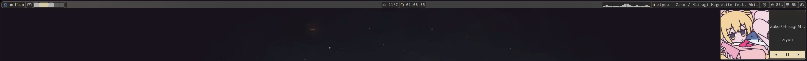
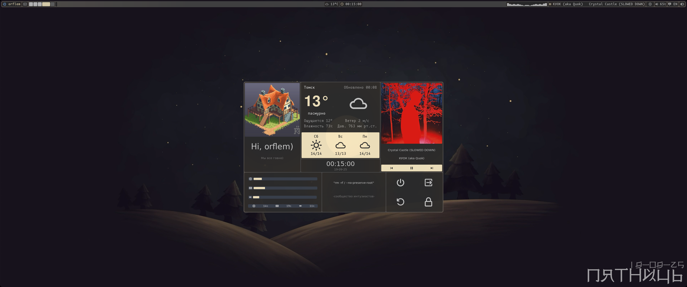
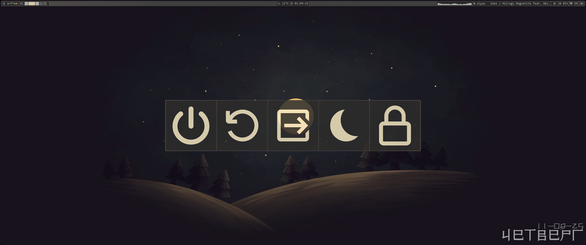
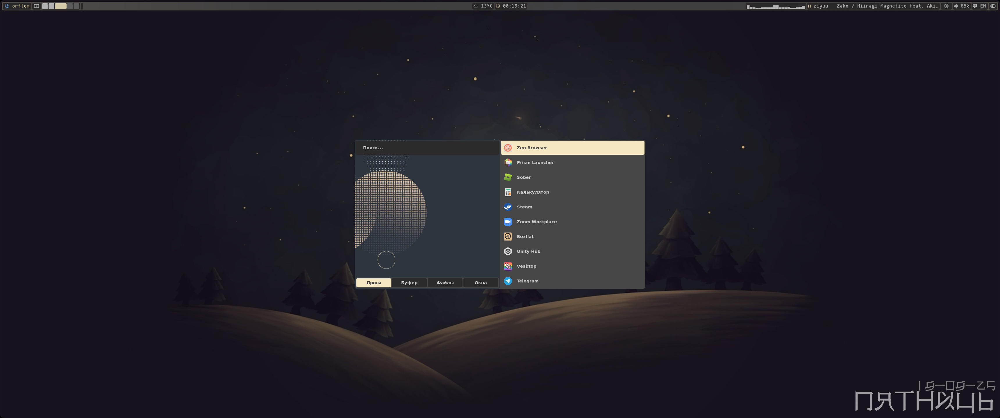
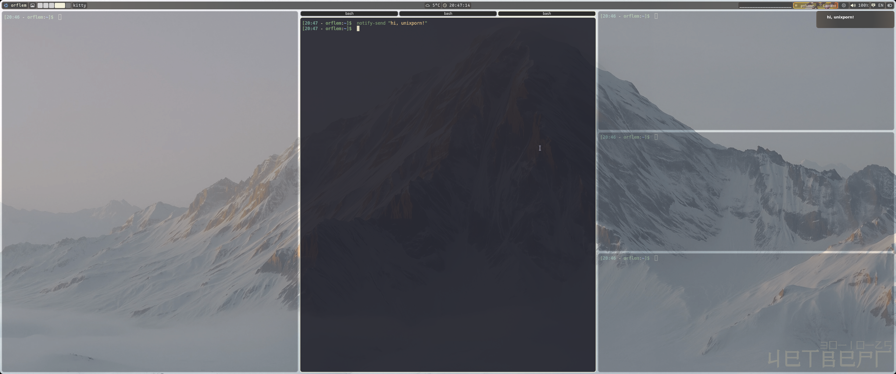
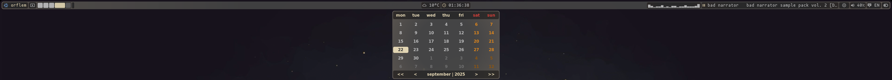
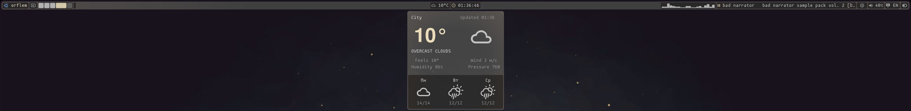
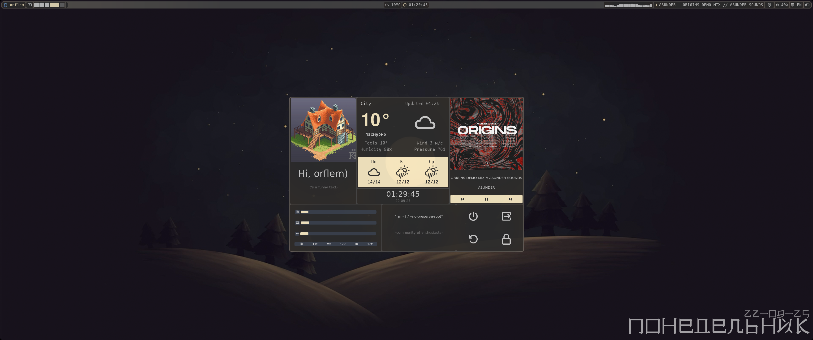
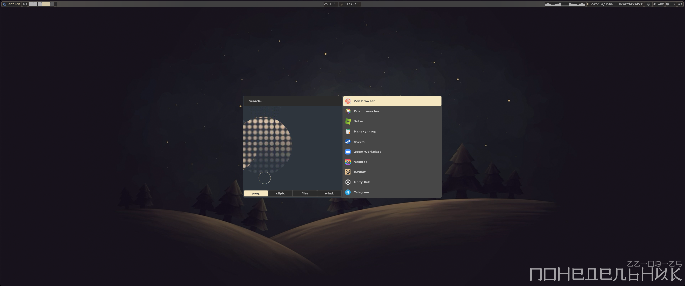

System : `NixOS 25.11 (unstable)`

# [rus](#rus) | [eng](#eng)

# Rus

# Важно
```
В данных конфигах есть спорные решения, которые не всем понравятся:
  использование NixOS без home manager и flakes;
  bash, вместо fish;
  mpvpaper, вместо hyprpaper;
Но это можно выбрать
```

# Об конфигах
```
Эти конфиги, сделанные на базе Hyprland, eww и rofi

Я пытался проверить, смогу ли я создать весь ui только на eww и rofi, не убив сильно производительность, но точно не скажу по поводу слабых ПК, ведь мой ПК достаточно мощный

Прошу строго не судить
```

## -- Основной софт -- :
* Терминал: `Kitty`
* Лаунчер: `Rofi`
* Блокировщик экрана: `Hyprlock`
* Мониторинг системы: `Btop | htop` (также есть в dashboard)
* Интерфейс: `eww`
* Проводник: `ranger | yazi | thunar`
* Редакторы: `micro | helix`
* Консольные оболочки: `bash | fish`
* Обои: `mpvpaper | hyprpaper`
* Основная тема для терминалов, tty, gtk и прочего: `kanagawa`

```
в случае тормозов, замените mpvpaper на hyprpaper,
раскомментировав в hyprland.conf строку с hyprpaper и закомментировав строку с mpvpaper,
а в eww по пути "~/.config/eww/bar" в файле hbar.yuck заменить (lbgz) на (bg)
```

## -- Комбинации клавиш -- :
* `super + e` - проводник
* `super + q` - терминал
* `super + o` - Кнопки питания
* `super + l` - dashboard
* `super + 1-0` или `super + scrll up | scrll dwn` - переключение между р. столами
* `super + shift + 1-0` или `super + shift + scroll up | scroll down` - перенос программ между р. столами 
* `super + ctrl + стрелки` или `super + пкм` - ресайз окон
* `super + стрелки` или `super + лкм` - перемещение окна
* `super + shift + ctrl + w | s | a | d` - переключение между окнами
* `super + alt + лкм` - изменение типа окна: плавующий или в тайлинге
* `super + w` - перезапуск eww
* `super + s` - полноэкранный снимок
* `super + d` - снимок выделенной области
* `super` - открыть лаунчер приложений
* `super + p` - центровка окна относительно вертикали
* `capslock` или `shift + alt` - смена языка
* `shift + capslock` - включить | выключить капс
* `super + space` - раскрыть окно, поверх других

# как выглядят конфиги:
### Р.стол


### Панель управления



### Dashboard


### Кнопки питания


### Лаунчер приложений


# Установка
```
1. Установить NixOS
2. Доработайте конфиг NixOS под себя, учтите, что нужно вписать своего юзера и доп. диски (если есть)
3. замените конфиг NixOS или впишите то, чего не хватает в конфиге для работы конфигов (почти весь мой конфиг)
4. из config перекинуть файлы в "~/.config", а из local в "~/.local"
5. sudo nixos-rebuild switch
6. Удачи попытаться понять не до конца понятого "гения")
```

#### Лицензия
Для уведомлений используется код (в папке eww/notif), написанный Vimjoyer, там же и его MIT лицензия

Эти конфигурации распространяются под лицензией **GNU GPL v3**.

Простыми словами это значит:
- Вы можете свободно использовать, изучать и изменять этот код.
- Если вы делитесь своими изменениями или собранной на основе этого кодом с другими (например, выложили форк), вы **обязаны** сделать ваш исходный код также открытым и доступным для всех под этой же лицензией.

Это гарантирует, что все улучшения и производные работы останутся свободными и открытыми, как и оригинал.

Полный текст лицензии см. в файле [LICENSE](./LICENSE).

# Eng

# Important
```
These configs include controversial choices that not everyone may like:
  using NixOS without Home Manager and Flakes;
  bash instead of fish;
  mpvpaper instead of hyprpaper;
But these are customizable.
```
# About the Configs
```
These configs are built on Hyprland, eww, and rofi.

I tried to see if I could create the entire UI using only eww and rofi without heavily impacting performance, but I can't say for sure about weaker PCs since my PC is quite powerful.

Please don't judge too harshly.
```

## -- Core Software -- :
* Terminal: `Kitty`
* Launcher: `Rofi`
* Screen Locker: `Hyprlock`
* System Monitoring: `Btop | htop (also available in the dashboard)`
* Interface: `eww`
* File Manager: `ranger | yazi | thunar`
* Editors: `micro | helix`
* Shells: `bash | fish`
* Wallpaper: `mpvpaper | hyprpaper`
* Main theme for terminals, TTY, GTK, etc.: `kanagawa`

```
If you experience lag, replace mpvpaper with hyprpaper:
uncomment the hyprpaper line and comment the mpvpaper line in hyprland.conf,
and in eww at "~/.config/eww/bar" in the hbar.yuck file, replace (lbgz) with (bg).
```

## -- Keybindings -- :
* `Super + e` - File Manager
* `Super + q` - Terminal
* `Super + o` - Power Menu
* `Super + l` - Dashboard
* `Super + 1-0` or `Super + Scroll Up | Scroll Down` - Switch between workspaces
* `Super + Shift + 1-0` or `Super + Shift + Scroll Up | Scroll Down` - Move windows between workspaces
* `Super + Ctrl` + `Arrow Keys or Super + RMB` - Resize windows
* `Super + Arrow Keys` or `Super + LMB` - Move windows
* `Super + Shift + Ctrl + w | s | a | d` - Switch between windows
* `Super + Alt + LMB` - Toggle window type: floating or tiling
* `Super + w` - Restart eww
* `Super + s` - Fullscreen screenshot
* `Super + d` - Selected area screenshot
* `Super` - Open application launcher
* `Super + `p - Center window vertically
* `CapsLock` or Shift + Alt - Switch language
* `Shift` + CapsLock - Toggle Caps Lock
* `Super` + Space - Expand window above others

## What the configs look like:
### Desktop



### Control Panel




### Dashboard


### Power Menu


### Application Launcher


# Installation

```
1. Install NixOS.
2. Customize the NixOS config for your needs: make sure to add your user and additional disks (if any).
3. Replace the NixOS config or add missing parts to make these configs work (almost my entire config is needed).
4. Move files from the config folder to "~/.config" and from local to "~/.local".
5. Run sudo nixos-rebuild switch.
6. Good luck trying to understand the not-quite-comprehensible "genius" :)
```

#### License
The notification code (in the eww/notif folder) is written by Vimjoyer and includes their MIT license.

These configurations are distributed under the **GNU GPL v3** license.

In simple terms, this means:

You are free to use, study, and modify this code.

* If you share your modifications or code based on this work (e.g., by forking it), you must make your source code equally open and available to everyone under this same license.
* This ensures that all improvements and derivative works remain free and open, just like the original.

For the full license text, see the [LICENSE](./LICENSE) file.
