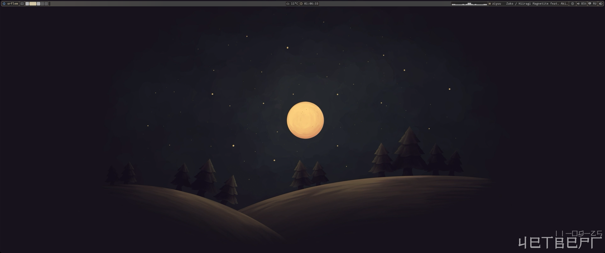
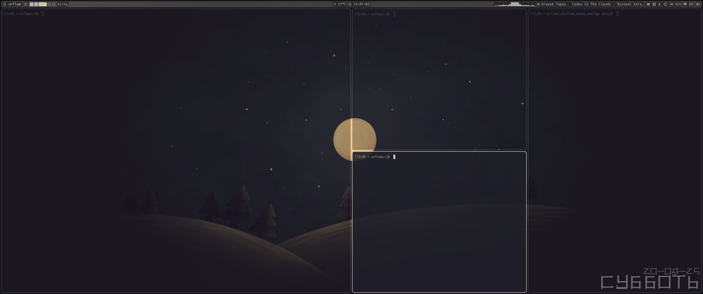
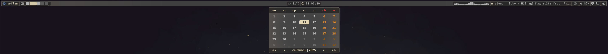
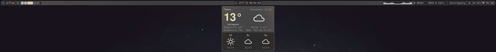

System : `NixOS`

# Важно
```
В данных конфигах есть спорные решения, которые не всем понравятся:
  использование NixOS без home manager и flakes;
  bash, вместо fish;
  mpvpaper, вместо hyprpaper;
  Но это можно выбрать
```

# Об конфигах
```
Эти конфиги, сделанные на базе Hyprland, eww и rofi

Я пытался проверить, смогу ли я создать весь ui только на eww и rofi, не убив сильно производительность, но точно не скажу по поводу слабых ПК, ведь мой ПК достаточно мощный

Прошу строго не судить
```

## -- Основной софт -- :
* Терминал: `Kitty`
* Лаунчер: `Rofi`
* Блокировщик экрана: `Hyprlock`
* Мониторинг системы: `Btop | htop` (также есть в dashboard)
* Интерфейс: `eww`
* Проводник: `ranger | yazi | thunar`
* Редакторы: `micro | helix`
* Консольные оболочки: `bash | fish`
* Обои: `mpvpaper | hyprpaper`

```
(в случае тормозов, замените mpvpaper на hyprpaper,
раскомментировав в hyprland.conf строку с hyprpaper и закомментировав строку с mpvpaper,
а в eww по пути "~/.config/eww/bar" в файле hbar.yuck заменить (lbgz) на (bg))
```

## -- Комбинации клавиш -- :
* `super + e` - проводник
* `super + q` - терминал
* `super + o` - Кнопки питания
* `super + l` - dashboard
* `super + 1-0` или `super + scrll up | scrll dwn` - переключение между р. столами
* `super + shift + 1-0` или `super + shift + scroll up | scroll down` - перенос программ между р. столами 
* `super + ctrl + стрелки` или `super + пкм` - ресайз окон
* `super + стрелки` или `super + лкм` - перемещение окна
* `super + shift + ctrl + w | s | a | d` - переключение между окнами
* `super + alt + лкм` - изменение типа окна: плавующий или в тайлинге
* `super + w` - перезапуск eww
* `super + s` - полноэкранный снимок
* `super + d` - снимок выделенной области
* `super` - открыть лаунчер приложений
* `super + p` - центровка окна относительно вертикали
* `capslock` или `shift + alt` - смена языка
* `shift + capslock` - включить | выключить капс
* `super + space` - раскрыть окно, поверх других

# как выглядят конфиги:
### Р.стол



### Панель управления




### Dashboard


### Кнопки питания


### Лаунчер приложений


# Установка
```
1. Установить NixOS
2. Доработайте конфиг NixOS под себя, учтите, что нужно вписать своего юзера и доп. диски (если есть)
3. замените конфиг NixOS или впишите то, чего не хватает в конфиге для работы конфигов (почти весь мой конфиг)
4. из config перекинуть файлы в "~/.config", а из local в "~/.local"
5. sudo nixos-rebuild switch
6. Удачи попытаться понять не до конца понятого "гения")
```

#### Лицензия
Для уведомлений используется код (в папке eww/notif), написанный Vimjoyer, там же и его MIT лицензия

Эти конфигурации распространяются под лицензией **GNU GPL v3**.

Простыми словами это значит:
- Вы можете свободно использовать, изучать и изменять этот код.
- Если вы делитесь своими изменениями или собранной на основе этого кодом с другими (например, выложили форк), вы **обязаны** сделать ваш исходный код также открытым и доступным для всех под этой же лицензией.

Это гарантирует, что все улучшения и производные работы останутся свободными и открытыми, как и оригинал.

Полный текст лицензии см. в файле [LICENSE](./LICENSE).
